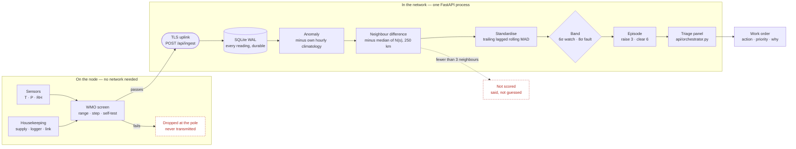
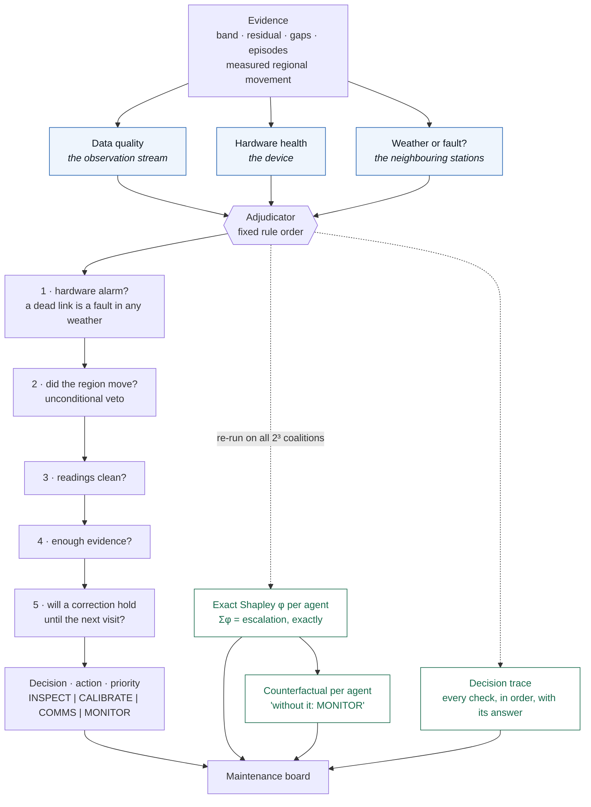
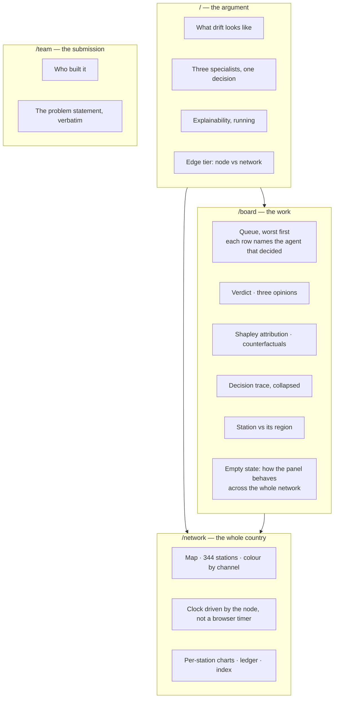
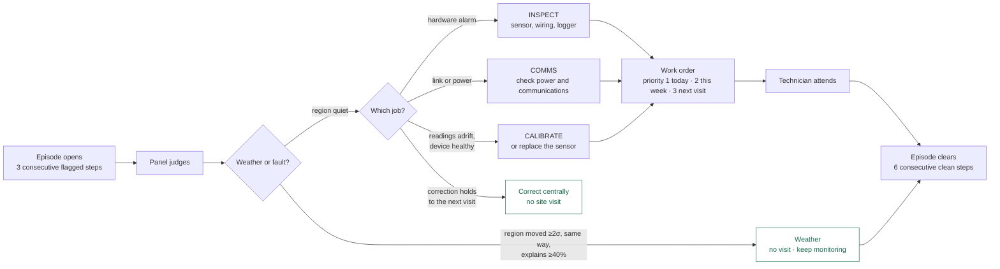

# Blueprint charts, redrawn against the built system

The blueprint's four architecture figures are base64-rendered mermaid embedded as
`` — about 279 KB of encoded SVG across four
lines. These are the replacements, as live mermaid source.

Artifacts render mermaid natively, so in the blueprint each `` can be replaced by:

```html
<pre class="mermaid">
  ...source below...
</pre>
```

which is editable afterwards instead of being a picture of a diagram.

---

## 1 — The system end to end

**What changed:** the station tier now really exists (ESP32 in simulation, TLS to the
Space). The learned residual model is gone. The panel replaced the five-checker design.
The store is SQLite, not TimescaleDB.



---

## 2 — The reasoning layer  ← **the biggest change**

**What changed:** five checkers became **three agents and an adjudicator**. The offline
ARM/DQR label path is deleted entirely. Attribution is exact Shapley over the panel, not
SHAP over a model. There is no model.



**Note for the caption:** the old caption claims ARM historical DQR labels feed the
offline path. That corpus and its classifier were deleted — the caption has to go with
the diagram.

---

## 3 — What the operator sees

**What changed:** three screens became four routes, and "Device Health" is no longer a
panel on a dashboard — it is one of the three agents, and it is silent on simulated rows
because the export carries no housekeeping.



---

## 4 — What the operator does

**What changed:** the loop still closes twice, but the "rejected → weather event" branch
is now a *measured* veto with a number on it, not an operator judgement.



---

# Sections to remove or mark superseded

Ordered by how misleading they are now.

| § | Section | What to do |
|---|---|---|
| 319 | The AI architecture — a panel that must corroborate | **Replace the five-checker SVG** with chart 2. The built panel is three agents. |
| 702 | The learned layer, revised | **Delete.** The model was deleted; the section plans a thing that no longer exists. |
| 718 | The ML layer, concretely | **Delete.** The 12-element feature vector and its worked figure describe the deleted classifier. |
| 904 | Explainability, done properly | **Rewrite.** It plans SHAP over a model. Replace with exact Shapley over the panel — as-built §18 has the text. |
| 581 | Architecture (four-stage pipeline) | **Amend.** Stage 3 "learned residual model" does not exist. The pipeline is anomaly → neighbour → sigma → band → panel. |
| 1050 | The dashboard — three screens | **Mark superseded.** Three wireframes vs four built routes; keep as design history, point at chart 3. |
| 1829 | What carries over from the PS26178 work | **Delete.** Previous problem statement; nothing carries over that is still in the tree. |
| 1785 | Optional hardware — ₹1,120 per station | **Amend.** Firmware now runs end to end in Wokwi against the deployed Space. Not optional, not untested — just not on physical hardware. |
| 1515 | Production architecture | **Keep, marked aspirational.** TimescaleDB, Redis, worker pool — none built. Storage is one SQLite file. |
| 1730 | Work split · 1748 Demo script · 1677 Build order | **Delete or rewrite.** All predate the current shape of the work. |
| — | Every ARM mention | **Delete.** 24 Python and 8 web files removed; there is no ARM corpus in the project. |

**Keep untouched** — these are the reasoning that got us here and they still hold:
the problem statement, "the one problem that actually matters", the physics with three
parameters, where the accuracy comes from, traps that will bite you, evaluation protocol,
prior art and references.
